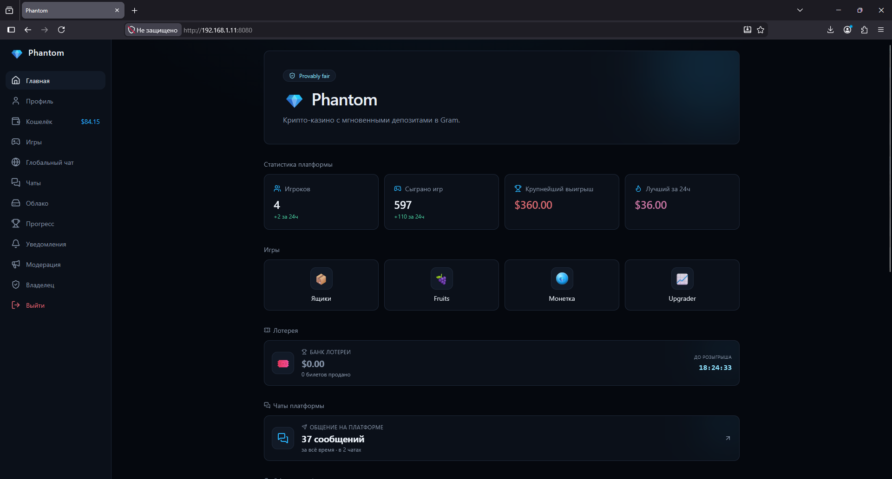

# Phantom

Gambling platform. Educational purposes only.



## Backend
### Tech Stack

Java 17, Spring Boot 3.5, Spring Security, Spring Data JPA, Spring WebSocket, Hibernate, PostgreSQL, JJWT, Lombok, Gradle.

### Building

**Requirements:** Java 17, Gradle, PostgreSQL

1. Create a PostgreSQL database:
```sql
CREATE DATABASE phantom;
```

2. Set environment variables. For details see [application.properites](src/main/resources/application.properties).

Cloudflare is blocked in some regions. In this case, set up a proxy:
```
JAVA_TOOL_OPTIONS=-Dhttps.proxyHost=127.0.0.1 -Dhttps.proxyPort=10801 -Dhttp.proxyHost=127.0.0.1 -Dhttp.proxyPort=10801
```


On Windows, you can generate random base64 key with PowerShell:
```
Add-Type -AssemblyName System.Security
[Reflection.Assembly]::LoadWithPartialName("System.Security")
$rijndael = new-Object System.Security.Cryptography.RijndaelManaged
$rijndael.GenerateKey()
Write-Host([Convert]::ToBase64String($rijndael.Key))
$rijndael.Dispose()
```

You can get your `TON_API_KEY` here:
```
Telegram @toncenter
```

3. Run:
```
./gradlew bootRun
```

## Getting started
1. Register an `OWNER` account with an `OWNER_KEY`
2. Login
3. Set master wallets

## Deploying (important)
* Use full disk encryption (LUKS, BitLocker)
* Use HTTPS
